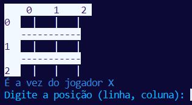

# Tic-Tac-Toe Game in Python

  

## English

This repository contains the recreation of tic-tac-toe in the terminal
 

You have the option to play on 3x3, 5x5, 7x7 and 9x9 board. The game also has the option of being played in pairs or against the machine.

## Português 

Este repositório contém a recriação do jogo da velha no terminal
 

Você tem a opção de jogar no tabuleiro 3x3, 5x5, 7x7 e 9x9. O jogo tambem conta com a opção de ser jogado em dupla ou contra a maquina
